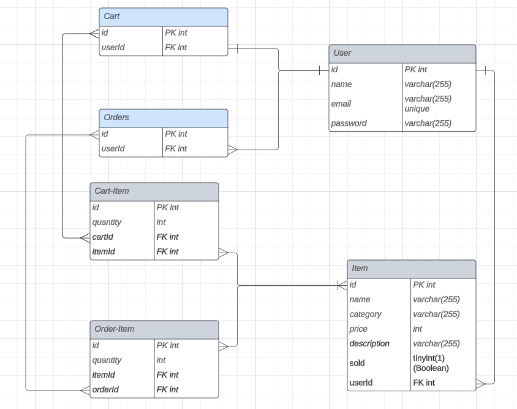

# 

## <h2 align="center"> An online marketplace to buy, sell, and trade skateboarding items. </h2>

### 
 [deployed site](https://hardpost-f79ecee5b44d.herokuapp.com/) 

## 
Motivation

The prices of skateboarding hard-goods are at an all time high. Skateboarders typically accumulate lots of gear while many people cannot afford to buy those items brand new. There is no dedicated platform for people to specifically buy or sell skateboarding items from other individuals at a more affordable price. The main option has been to go on generic online marketplaces where the majority of users have no interest in skateboarding products. Hardpost aims to close that gap.

## 
Description

The concept is straightforward. Skateboarders can create an account and make posts of items they have for sale, including an image and price tag. Other users can browse those items, add them to their cart, and then must be logged in with an account to purchase those items.

## 
Technologies used

 

[badges source](https://github.com/alexandresanlim/Badges4-README.md-Profile)

## 
Testing

- For unit testing, run 'npm run test' in both client and server folders individually (runs jest tests).
- For integration testing, run 'npm start' at root of the project to start up the client and server. Then cd into the client and run 'npm run cypress', select chrome as the browser testing environment

## 
 Relational Database Design

## 
 steps for running locally

- clone repo
- 'npm install' all dependencies inside root, client, and server folders
- in server folder, create .env file with DB_NAME="hardpost_db", and DB_USER and DB_PASSWORD set to your MySQL credentials (default user is 'root')
- still in server, log into MySQL shell and run 'source db/schema.sql' to create database
- return to root of project an 'npm run start' to concurrently run node-express server and vite dev mode
